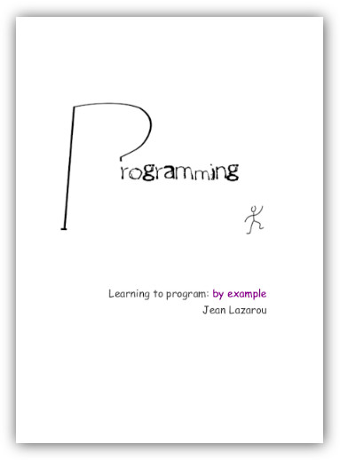

# learn-to-program-quiz

## Description



Quizzes for the book "Learning to program: by example" see https://leanpub.com/learning-to-program-by-example

See the quiz here https://jeanlazarou.github.io/learning-to-program-quiz/

(styles based on project https://github.com/AykutSarac/react-quiz)

## Use the source code

You can run the app with

```bash
yarn
yarn start
```

It starts a browser at `http://localhost:3000/`.

You see a page with all chapters where you can start the quiz for every chapter.

You can start a quiz for a chapter with a link like: `http://localhost:3000/?chapter=12` (chapter 13).

(chapter parameter is the chapter index, starting at index 0 for the first chapter)
